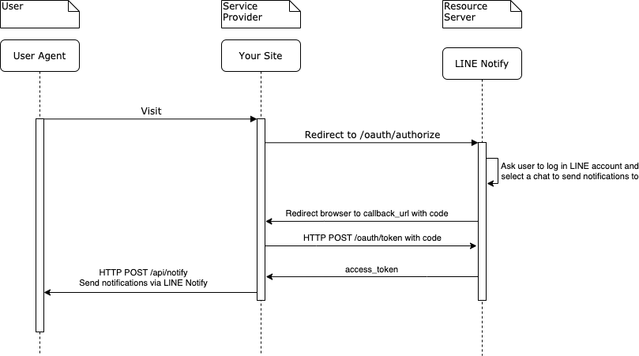

# LINE-Notify

This example shows how to use LINE Notify service.

## Introduction to LINE Notify

Instead of creating a LINE official account and use [Mesaging API](https://developers.line.biz/en/reference/messaging-api/) to push messages to users. \
LINE Notify enables you to send messages without a LINE official account.

LINE Notify uses [OAuth 2](https://tools.ietf.org/html/rfc6749) for web service providers. \
You can easily implement a service and send messages to users on LINE with LINE Notify.

The sequence diagram is shown and the flow is explaned below: \

1. User visits your website(service provider).
2. Your website redirect user to LINE OAuth2 authorization endpoint.
3. User selects a channel to send notifications to.
4. Redirect to `callback_url` you registered on LINE notify service page with `code`.
5. You send a `HTTP POST` request to LINE OAuth2 token endpoint.
6. Receive the access token and store it.
7. Call notification API with the access token to send notifications.

## Register a LINE Notify Service

### 1. Go to [LINE Notify](https://notify-bot.line.me/en/) and log in your LINE account

### 2. [Register a new service](https://notify-bot.line.me/my/services/new)

- Fill in "http://localhost:3000/index" for `Service URL`.
- Fill in "http://localhost:3000/callback" for `Callback URL`.
- Go to [Manage registered services](https://notify-bot.line.me/my/services/) and remember your **Client ID** and **Client Secret**.

## Use Your Client ID and Client Secret

- In `src/index.html` and `src/notify.js`, replace `YOUR_CLIENT_ID` with your real client ID.
- In `src/notify.js`, replace `YOUR_CLIENT_SECRET` with your real client secret.

## How to Run

1. `yarn` to install dependencies.
2. `yarn start` to start localhost server.

## Try on [http://localhost:3000](http://localhost:3000)

1. Press the button **_LINE Notify_**.
2. You are redirected to LINE OAuth2 authorization endpoint to log in your LINE account, and select a chat to send notifications to.
3. You are redirected to your `callback_url`, which is [http://localhost:3000/callback], with `code`.
4. Enter the message you want to send to the chat.
    - In the step, your website sends an `HTTP POST` request with `code` to your backend server.
    - The backend server sends an `HTTP POST` request to LINE OAuth2 endpoint to get an `access token`.
    - The backend server calls notification API with `access token` to send to notification.

## Additional Information

The API rate limit of an API can be called (***per token***) on each service is 1000/hour. \
You can check your token status via `GET https://notify-api.line.me/api/status`. \
Before you exceed the rate limit and call notification API successfully, you will receive a response with the header denoting the API rat e limit status.

<table border="1">
  <thead>
    <tr>
      <th>Header name</th>
      <th>Description</th>
    </tr>
  </thead>
  <tbody>
    <tr>
      <td>X-RateLimit-Limit</td>
      <td>The limit of API calls per hour</td>
    </tr>
    <tr>
      <td>X-RateLimit-Remaining</td>
      <td>The number of possible remaining API calls</td>
    </tr>
    <tr>
      <td>X-RateLimit-ImageLimit</td>
      <td>The limit of Uploading image per hour</td>
    </tr>
    <tr>
      <td>X-RateLimit-ImageRemaining</td>
      <td>The number of possible remaining Uploading image</td>
    </tr>
    <tr>
      <td>X-RateLimit-Reset</td>
      <td>
        
The time when the limit is reset (<a href="http://en.wikipedia.org/wiki/Unix_time"
            target="_blank">UTC epoch seconds</a>)

        
ex:1472195604

      </td>
    </tr>
  </tbody>
</table>

## Demo

